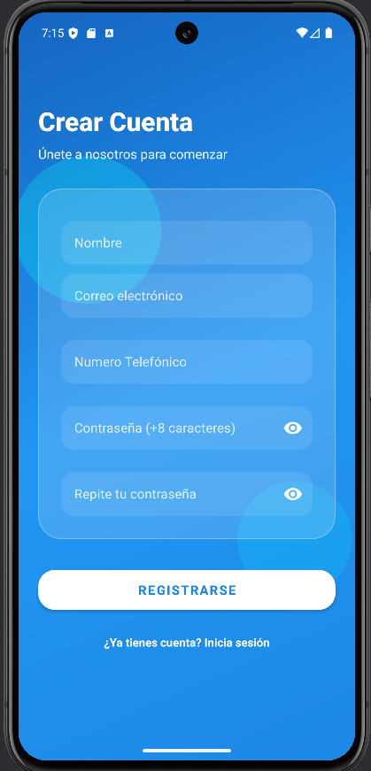
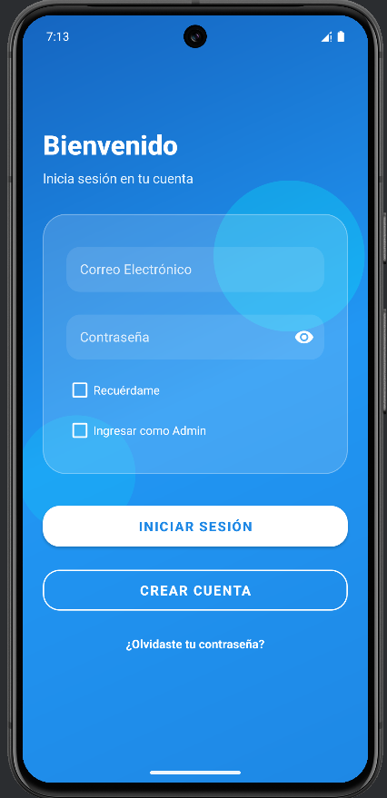
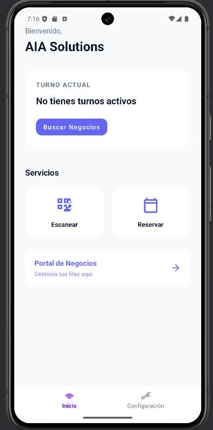
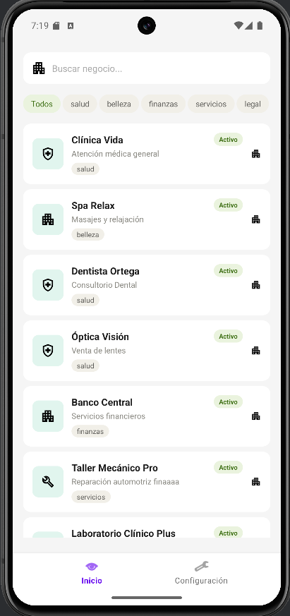
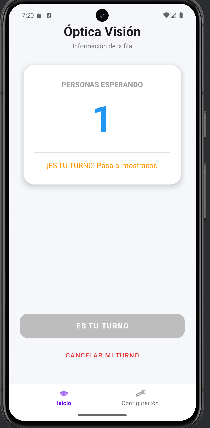
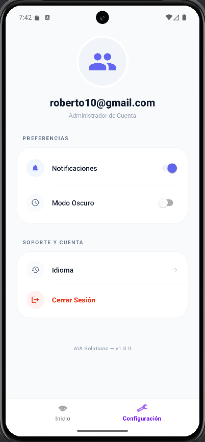
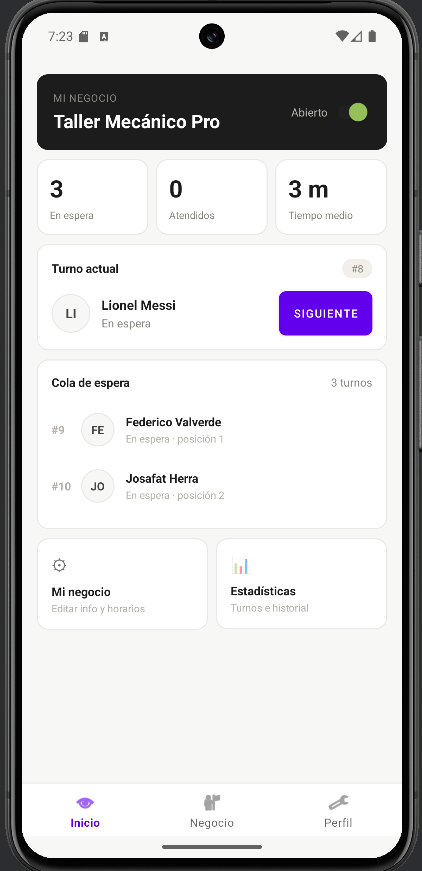
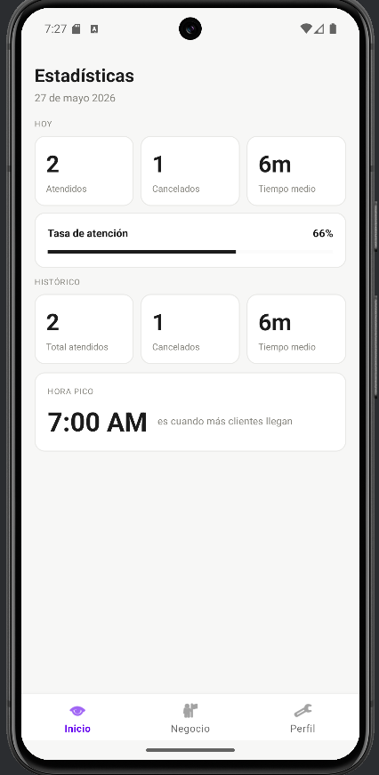
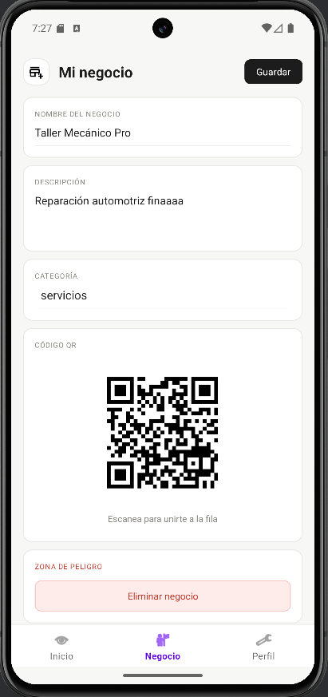
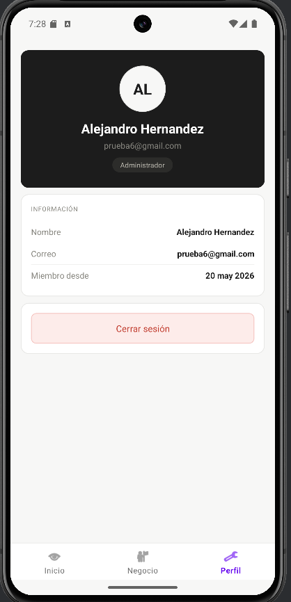

# 🎫 AIA Solutions

## Sistema Inteligente de Gestión de Colas y Turnos

<div align="center">

[](https://www.android.com)
[](https://kotlinlang.org)
[](https://firebase.google.com)
[](LICENSE)

**Transforma la experiencia de espera en una solución digital moderna e inteligente**

[Características](#-características-principales) • [Galería](#-galería-visual-de-pantallas) • [Pantallas](#-pantallas-de-la-aplicación) • [Tecnologías](#-tecnologías-utilizadas) • [Arquitectura](#-arquitectura-del-sistema) • [Instalación](#-instalación) • [Documentación](#-documentación)

</div>

---

## 🚀 Descripción General

**AIA Solutions** es una aplicación revolucionaria que elimina el caos de las colas tradicionales mediante un sistema digital inteligente de gestión de turnos en tiempo real.

### ¿Qué resuelve?

- ✅ **Clientes** no vuelven a esperar sin saber cuánto tiempo tardará
- ✅ **Negocios** controlan eficientemente sus colas y recursos
- ✅ **Tiempo** se optimiza tanto para usuarios como para administradores
- ✅ **Transparencia** total en el proceso de atención

---

## ⭐ Características Principales

### Para Usuarios (Clientes)

| Característica                         | Descripción                                                   |
| -------------------------------------- | ------------------------------------------------------------- |
| 🔍 **Búsqueda Inteligente**            | Encuentra negocios por categoría, nombre o ubicación cercana  |
| 🎫 **Solicitud Instantánea de Turnos** | Obtén tu número de turno en segundos, sin esperar físicamente |
| 📊 **Visualización de Cola**           | Ve en tiempo real cuántas personas están esperando            |
| ⏱️ **Posición en Fila**                | Sigue tu posición y recibe notificaciones cuando sea tu turno |
| 🔐 **Autenticación Segura**            | Inicia sesión con Firebase Authentication y Google Sign-In    |
| ⚙️ **Configuración Personalizada**     | Ajusta notificaciones, idioma y preferencias                  |

### Para Administradores (Dueños de Negocio)

| Característica              | Descripción                                        |
| --------------------------- | -------------------------------------------------- |
| 📈 **Panel de Control**     | Visualiza turnos actuales, en espera y completados |
| 🎯 **Gestión de Turnos**    | Avanza entre turnos con un clic                    |
| 📊 **Estadísticas en Vivo** | Tiempo promedio de atención, carga del negocio     |
| ✏️ **Edición de Negocio**   | Actualiza nombre, descripción y categoría          |
| 🔛 **Control de Estado**    | Abre/cierra tu negocio con un switch               |
| 👥 **Perfil de Admin**      | Gestiona tu información de usuario                 |

---

## 🛠️ Tecnologías Utilizadas

### Frontend

- **Kotlin 2.0.21** - Lenguaje principal con características modernas
- **Android API 24-36** - Compatibilidad amplia con dispositivos
- **Material Design 3** - Interfaz visual moderna y atractiva
- **AndroidX** - Componentes actualizados para retrocompatibilidad

### Backend & Base de Datos

- **Firebase Authentication** - Autenticación segura multicanal
- **Firebase Firestore** - Base de datos NoSQL en tiempo real
- **Firebase Cloud Services** - Sincronización instantánea

### Arquitectura & UI

- **Fragments + Navigation** - Estructura modular y escalable
- **RecyclerView** - Listas dinámicas y eficientes
- **ConstraintLayout** - Diseños responsive
- **Bottom Navigation** - Navegación intuitiva

### Librerías Clave

```gradle
// Autenticación
implementation("com.google.firebase:firebase-auth:24.0.1")
implementation("com.google.android.libraries.identity.googleid:googleid:1.2.0")

// Base de Datos
implementation("com.google.firebase:firebase-firestore-ktx:25.1.1")

// UI & Material
implementation("com.google.android.material:material:1.13.0")
implementation("androidx.constraintlayout:constraintlayout:2.2.1")

// Seguridad
implementation("androidx.credentials:credentials:1.5.0")
```

---

## � Galería Visual de Pantallas

Aquí puedes ver las interfaces reales de la aplicación:

### Pantallas de Cliente

<table>
<tr>
<td align="center">

<br/><b>Crear Cuenta</b><br/>Registro de nuevos usuarios
</td>
<td align="center">

<br/><b>Login</b><br/>Acceso seguro a la plataforma
</td>
<td align="center">

<br/><b>Inicio</b><br/>Panel principal del usuario
</td>
</tr>
</table>

<table>
<tr>
<td align="center">

<br/><b>Búsqueda de Negocios</b><br/>Explora negocios por categoría
</td>
<td align="center">

<br/><b>Detalle de Turno</b><br/>Solicita y gestiona turnos
</td>
<td align="center">

<br/><b>Perfil</b><br/>Información personal del usuario
</td>
</tr>
</table>

### Pantallas de Administrador

<table>
<tr>
<td align="center">

<br/><b>Admin Dashboard</b><br/>Navegación administrativa
</td>
<td align="center">

<br/><b>Panel de Control Estadistico</b><br/>Gestión de turnos en tiempo real
</td>
<td align="center">

<br/><b>Mi Negocio</b><br/>Edición de información del negocio
</td>
</tr>
</table>

<table>
<tr>
<td align="center">

<br/><b>Perfil Admin</b><br/>Información del administrador
</td>
</tr>
</table>

---

## 🏗️ Arquitectura del Sistema

### Estructura de Capas

```
┌─────────────────────────────────────────────────────┐
│          CAPA DE PRESENTACIÓN (UI)                  │
│  Activities | Fragments | Adapters | Layouts       │
└─────────────────────────────────────────────────────┘
              ↕ (ViewBinding / Listeners)
┌─────────────────────────────────────────────────────┐
│      CAPA DE LÓGICA DE NEGOCIO (Services)           │
│  FirestoreService | Validaciones | Lógica          │
└─────────────────────────────────────────────────────┘
              ↕ (Firestore API Calls)
┌─────────────────────────────────────────────────────┐
│         CAPA DE DATOS (Firebase)                    │
│  Firestore | Firebase Auth | Cloud Services        │
└─────────────────────────────────────────────────────┘
```

### Modelos de Datos

```kotlin
// Negocio
data class Business(
    val id: String,
    val name: String,
    val description: String,
    val category: String,
    val currentTurn: Long,
    val isActive: Boolean,
    val createdAt: Timestamp
)

// Turno
data class Turno(
    val id: String,
    val number: Long,
    val userId: String,
    val status: String,
    val createdAt: Timestamp
)
```

### Estructura de Firestore

```
firestore/
├── users/{uid}
│   ├── name
│   ├── email
│   ├── createdAt
│   └── role
├── businesses/{businessId}
│   ├── name
│   ├── description
│   ├── category
│   ├── currentTurn
│   ├── isActive
│   ├── createdAt
│   └── turnos/{turnoId}
│       ├── number
│       ├── userId
│       ├── status
│       └── createdAt
```

---

## 🔄 Flujos Principales

### Flujo de Usuario (Cliente)

```
Login → Inicio → Buscar Negocio → Seleccionar Negocio
  ↓
Ver Cola → Solicitar Turno → Obtener Número
  ↓
Visualizar Posición → Esperar Notificación → Atendido
```

### Flujo de Administrador

```
Login Admin → Dashboard → Ver Turno Actual
  ↓
Atender Cliente → Presionar Siguiente
  ↓
Sistema asigna nuevo turno → Cola se actualiza en vivo
```

---

## 📦 Instalación

### Requisitos Previos

- **Android Studio** 2024 o superior
- **JDK 11** o superior
- **Android SDK 36** (API 36 target)
- **Gradle 8.13.2** o superior

### Pasos de Instalación

1. **Clonar el repositorio**

   ```bash
   git clone https://github.com/usuario/aia-solutions.git
   cd aia-solutions
   ```

2. **Configurar Firebase**
   - Descarga `google-services.json` desde Firebase Console
   - Coloca el archivo en `app/` directorio

3. **Compilar el proyecto**

   ```bash
   ./gradlew build
   ```

4. **Ejecutar en emulador o dispositivo**
   ```bash
   ./gradlew installDebug
   ```

---

## 🚀 Guía Rápida

### Para Usuarios (Clientes)

1. **Registrarse** - Crea una cuenta con email y contraseña
2. **Buscar** - Explora negocios por categoría
3. **Solicitar Turno** - Haz clic en "Solicitar mi turno"
4. **Esperar** - Recibe notificaciones cuando sea tu turno
5. **Ser Atendido** - Disfruta del servicio

### Para Administradores

1. **Registrarse como Admin** - Marca "Acceso de Administrador"
2. **Crear Negocio** - Completa información del negocio
3. **Dashboard** - Visualiza turnos en tiempo real
4. **Atender** - Presiona "Siguiente" para cambiar de turno
5. **Cerrar** - Toggle para abrir/cerrar tu negocio

---

## 📊 Estadísticas & Métricas

- **Tiempo de Respuesta**: < 100ms para sincronización
- **Usuarios Simultáneos**: Soporta miles en tiempo real
- **Disponibilidad**: 99.9% uptime (Firebase)
- **Seguridad**: Encriptación end-to-end
- **Compatibilidad**: Android 7.0+ (API 24+)

---

## 🔐 Seguridad

✅ **Autenticación Firebase** - Credenciales seguras  
✅ **Firestore Security Rules** - Acceso controlado a datos  
✅ **Validación de Entrada** - Prevención de inyecciones  
✅ **Encriptación de Datos** - En tránsito y en reposo  
✅ **HTTPS/TLS** - Todas las comunicaciones cifradas

---

## 🎯 Casos de Uso

### Escenario 1: Farmacia

- Pacientes solicitan turnos online
- Farmacéutico atiende desde panel de admin
- Estadísticas de congestión por horario

### Escenario 2: Restaurante

- Clientes reservan mesa con número de turno
- Personal llama cuando está lista
- Control de afluencia por turno

### Escenario 3: Centro de Salud

- Pacientes consiguen turno sin ir presencialmente
- Médico ve orden de atención en vivo
- Reporte de tiempos de atención

---

## 🚀 Roadmap Futuro

### Próximas Versiones

- 📱 **v1.1** - Notificaciones Push en tiempo real
- 📊 **v1.2** - Reportes analíticos avanzados
- 🗺️ **v1.3** - Geolocalización de negocios
- 💳 **v1.4** - Integración de pagos
- 🌍 **v1.5** - Multidioma y disponibilidad global
- 💬 **v1.6** - Chat en vivo con negocio
- ⭐ **v1.7** - Sistema de calificaciones

---

## 🤝 Contribuciones

¡Las contribuciones son bienvenidas! Para contribuir:

1. Fork el proyecto
2. Crea una rama para tu feature (`git checkout -b feature/AmazingFeature`)
3. Commit tus cambios (`git commit -m 'Add AmazingFeature'`)
4. Push a la rama (`git push origin feature/AmazingFeature`)
5. Abre un Pull Request

---

## 📄 Documentación

- 📖 [Manual de Usuario Completo](./MANUAL.md) - Documentación detallada
- 🏗️ [Arquitectura del Sistema](./ARCHITECTURE.md) - Diseño técnico
- 🧪 [Guía de Testing](./TESTING.md) - Pruebas unitarias e integración
- 🚀 [Guía de Deployment](./DEPLOYMENT.md) - Publicar en Play Store

---

## 📞 Soporte & Contacto

- **Email**: support@aiasolutions.com
- **Issues**: [GitHub Issues](https://github.com/usuario/aia-solutions/issues)
- **Documentación**: [Wiki del Proyecto](https://github.com/usuario/aia-solutions/wiki)
- **Comunidad**: [Discord Server](https://discord.gg/aiasolutions)

---

## 📋 Licencia

Este proyecto está bajo la licencia **MIT** - Ver archivo [LICENSE](LICENSE) para más detalles.

---

## 👨‍💻 Desarrolladores

- **Alejandro Balderas** - Lead Developer
- **Ian Buzzo** - Co-Lead Developer
- **Alan Barrera** - Co-Lead Developer
- Equipo de AIA Solutions

---

## 🙏 Agradecimientos

- Firebase por la infraestructura en la nube
- Google por Material Design
- La comunidad de desarrolladores Android

---

<div align="center">

### ⭐ Si te gusta este proyecto, ¡no olvides darle una estrella! ⭐

**Hecho con ❤️ en Android Studio**

[⬆ Volver al inicio](#-aia-solutions)

</div>

---

**Última actualización**: Mayo 2026  
**Versión**: 1.0.0  
**Estado**: 🟢 Producción
